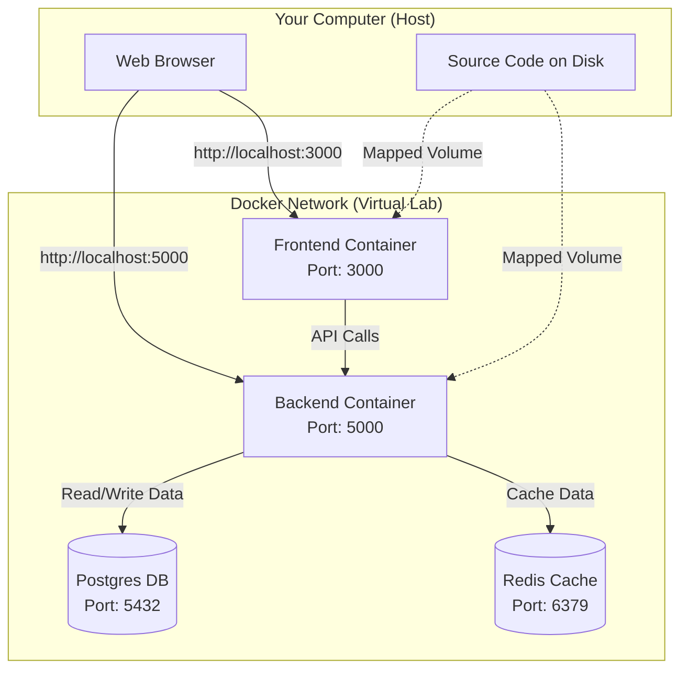

# Docker Architecture Explanation

This document explains how Docker is orchestrating your application. Think of Docker as a "virtual lab" inside your computer where all the parts of your application run together in harmony.

## System Overview (Mermaid Diagram)

## The "Orchestrator": Docker Compose
The file `docker-compose.yml` is the conductor. It tells Docker: "I need these 5 tools to run this app, and here is how they should talk to each other."

### 1. The Services (The Actors)

#### 🎨 **Frontend Service** (`frontend`)
*   **What it is**: The user interface (React/Vite).
*   **How it runs**: It builds from your `frontend/Dockerfile.dev`.
*   **Magic Trick**: It uses **Volumes**.
    *   `./frontend:/app`: This maps the code on your actual hard drive to the container. When you save a file in VS Code, the container sees it instantly and reloads the page (Hot Reloading).
*   **Access**: You see it at `http://localhost:3000`.

#### 🧠 **Backend Service** (`backend`)
*   **What it is**: The logic and API (Node.js/Express).
*   **How it runs**: It builds from your `backend/Dockerfile.dev`.
*   **Connections**: It knows how to find the database because we told it `DATABASE_URL=postgres://...`. In Docker, you use the *service name* (`postgres`) as the hostname, not "localhost".
*   **Access**: You can talk to it at `http://localhost:5000` (e.g., for health checks).

#### 🗄️ **Database** (`postgres`)
*   **What it is**: PostgreSQL database to store users, campaigns, etc.
*   **Persistence**: It uses a **Volume** (`postgres_data`). This means even if you delete the container, your data (users, login info) stays safe on your machine.

#### ⚡ **Cache** (`redis`)
*   **What it is**: Super fast memory storage for temporary data (sessions, queues).

#### 🛠️ **Adminer** (`adminer`)
*   **What it is**: A helper tool to look inside your database.
*   **Access**: `http://localhost:8080`.

## How they talk to each other
Docker creates a private network.
*   The **Backend** can talk to **Postgres** just by saying "Hey `postgres`".
*   The **Frontend** (running in your browser) talks to the **Backend** via `localhost:5000`.

## Why is this better?
If you didn't have Docker, you would have to:
1.  Download and install PostgreSQL (and hope it's the right version).
2.  Download and install Redis.
3.  Open 2 separate terminals.
4.  Manually type `npm run dev` in both.
5.  Fix weird "port in use" errors.

With Docker, you just typed `docker-compose up`, and it built the entire factory for you.
